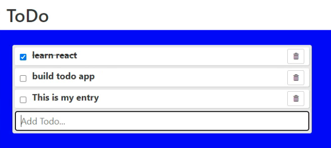

# ToDo List

## Description 
This is a simple Todo List Application using react to create and manage a todo list. There are options to mark an item complete, as well as unmark the item, and the ability to add and delete items from the list.

## Purpose 
This was done as an assignment in the MIT course - Full Stack Development with Mern

---------

## Technologies Used 
- HTML
- CSS
- Javascript

---------

## Installation 
- Clone this repository to your local machine
- Open a command line on your computer and run the command cd path-to-project-root (this should be the actual directory where the repository is located on your local machine)
- Within the same command-line window, run npm install http-server which will allow you to fire up a web server to access the paage
- Once the command completes successfully, run http-server -c-1
- Open your browser of choice and browse to http://127.0.0.1:8080/

## How to Run 
- When the page is loaded in your browser, you will notice no default entries
- If you would like to pre-load the list with entries, click on the Import button (loads data from todo.txt)
- To complete an item: Click on the checkbox of an entry. The checkbox will be checked and the text of the todo item will be striked out
- To uncomplete an item: Click on the checkbox of an entry. The checkbox will be unchecked and the text of the todo item will be normal
- To delete an item: Click on the trashcan button next to the item you want to remove. The item will be removed.
- To add an item: start typing in the input field at the bottom of the form and hit enter. The new todo item will be added to the bottom of your list
- To export your todo list to a file (todo.txt in your download directory), click on the Export button. If you want to be able to then reload this file, you need to copy the todo.txt from your download directory to your root directory where you are running your HTTP Server (where index.html is located)

---------

## Files 
- **/index.html** - Start-up file to be opened by browse 
- **/todo.js** - Contains the React code to build the todo item
- **/form.js** - Contains the React code to build the form to add new todo items
- **/index.js** - Contains the React code to build the page, Render ReactDOM
- **/styles.css** - Stylesheet file that positions objects, controls text, colors, and layout
- **/todo.txt** - Json Data for todo list
- **/ToDo.png** - Screenshot for ReadMe

---------

## Improvements Made
- 2022-03-19: Added priority with toggle on click of todo text/ Light-Orange, Dark-Orange, Dark-Red
- 2022-03-19: Added changing of todo text to green when completed
- 2022-03-19: Added slight gray hover over todo item
- 2022-03-19: Changed input box to gray and text to white
- 2022-03-21: Changed look of checkbox and delete button
- 2022-03-21: Added cursor over non-completed todo item
- 2022-03-21: Added sort based on priority (high to low)
- 2022-03-22: Added ability to Import file (needs to be in root directory where your HTTP Server is running from *where index.html is - todo.txt)
- 2022-03-22: Added ability to Export file (exports to download directory - todo.txt)

## Roadmap of Future Improvements
- Store todo to a file to be saved and reloaded

---------

## Contributing 
Pull requests are welcome. For major changes, please open an issue first to discuss what you would like to change.

## License
[The MIT License (MIT)](https://github.com/slumpbuster/Formik/blob/main/LICENSE)
